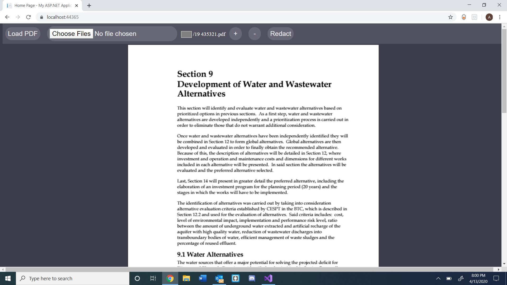
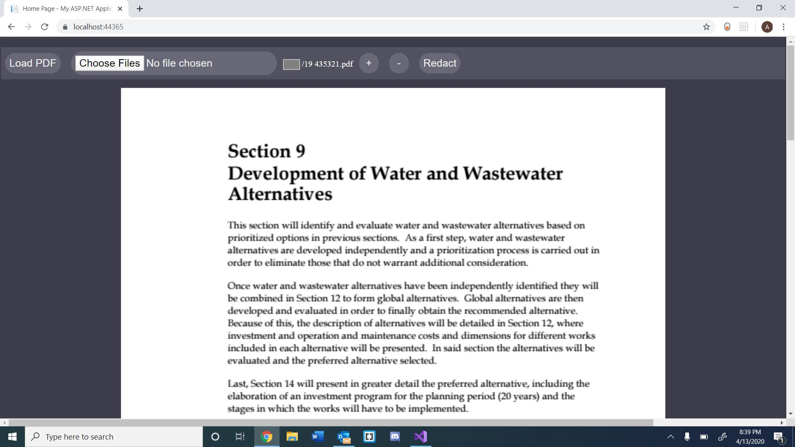
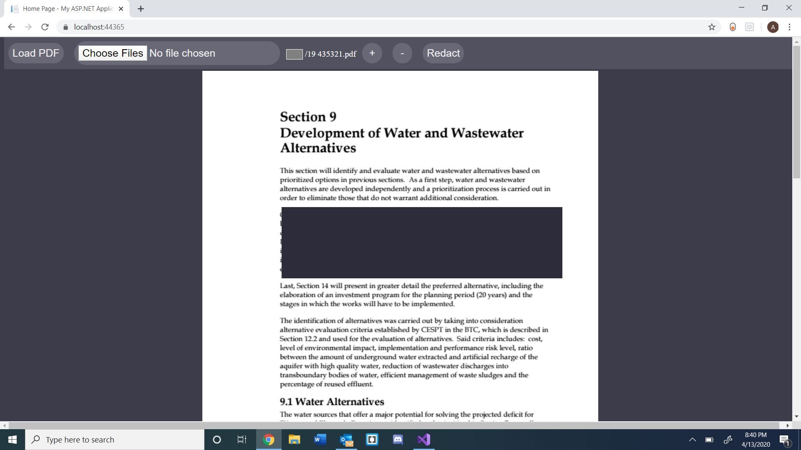

## Pdf In Browser Rendering

**Project description:** The purpose of this project was to provide a faster Pdf renderer for web browsers for our client.  When we started this project, our client was using a custom renderer they had built using Pdf.js, which is Mozilla Firefoxs' built in Pdf renderer. However the nature of Pdf.js controlling everything through the front end made it slow with large documents, and rather cumbersome to add functionality to. So our solution was to use Googles open source Pdfium. 

### 1. Tech Stack

- Frontend
    - Visual Studio
    - ASP.Net
    - Html
    - Css
    - Javascript

- Backend
    - Visual Studio
    - C#
    - ASP.Net

### 2. How It Works

To solve the main problem with Pdf.js - front end rendering - Pdfium came in handy.  With Pdfium, we were able to render the documents on the backend, and send them to the front end using API calls that were made when the page reached a certain scroll position. Our goal was the stay one page ahead of wherever the user currently was, so as soon as the top of the last page was scrolled into the viewport, the frontend would make an API call for the next page.  The API calls return an image path for the rendered page, and all of the hidden text layer information as a two dimensional array, all contained inside a single JSON object.  Being able to render pages on demand also aided in solving the speed issue PDF.js has with large documents.  When the user selects a Pdf to load, the server renders and saves a small chunk of pages, and sends them to the front end, and then proceeds to begin rendering and saving the remaining pages, which are made available to the API calls as soon as they're saved. This resulted in the user being able to start viewing the document they selected much faster.

### 3. Features List

- Backend rendering
- Frontend load pages on demand
- Hidden text layer
- Page jumping via page number
- Zooming
- Redactions

### 4. My Contributions

- Getting Pdfium up and running
- Backend rendering of documents
- Frontend API calls to render pages
- Page Jumping
- Zooming

### 4. Screenshots

Basic Rendering

Zoom In

Redaction

For more details see [The Repository](https://github.com/abbiggs/PDF_ASP.Net).
